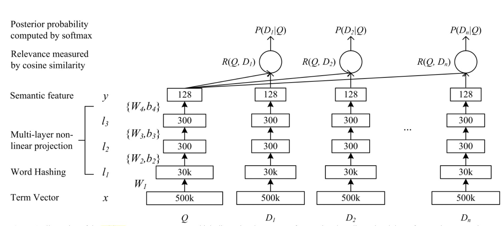
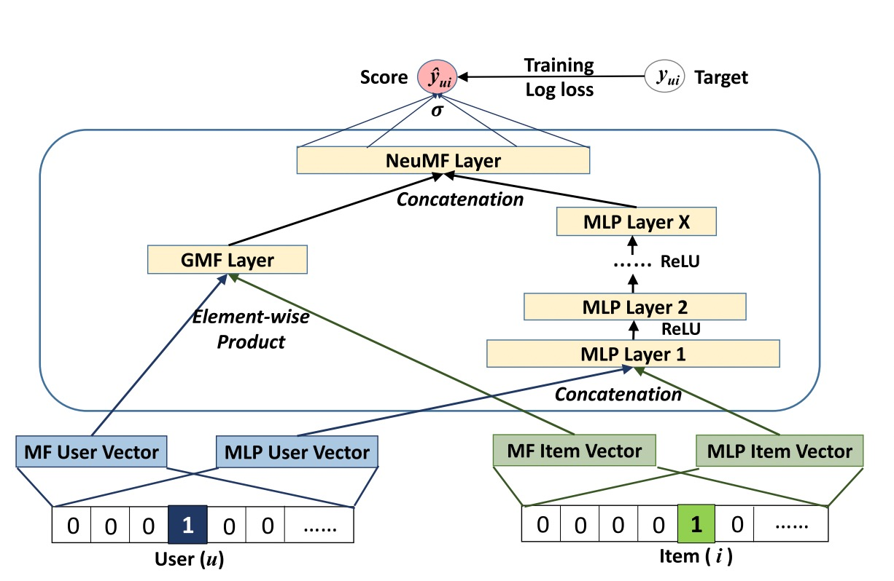
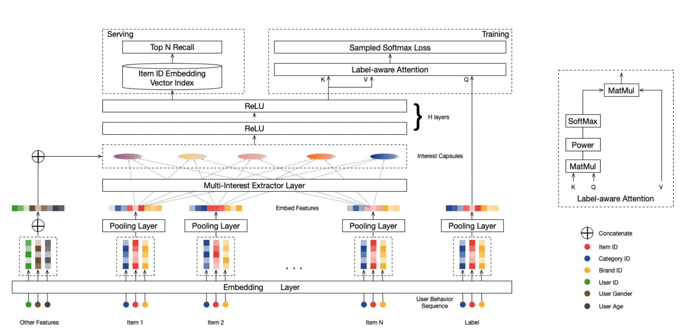

# Features

## Feature Columns
### SparseFeat
``SparseFeat`` is a namedtuple with signature ``SparseFeat(name, vocabulary_size, embedding_dim, use_hash, dtype, embeddings_initializer, embedding_name, group_name, trainable)``

- name : feature name
- vocabulary_size : number of unique feature values for sprase feature or hashing space when `use_hash=True`
- embedding_dim : embedding dimension
- use_hash : defualt `False`.If `True` the input will be hashed to space of size `vocabulary_size`.
- dtype : default `int32`.dtype of input tensor.
- embeddings_initializer : initializer for the `embeddings` matrix.
- embedding_name : default `None`. If None, the embedding_name will be same as `name`.
- group_name : feature group of this feature.
- trainable: default `True`.Whether or not the embedding is trainable.

### DenseFeat
``DenseFeat`` is a namedtuple with signature ``DenseFeat(name, dimension, dtype)``

- name : feature name
- dimension : dimension of dense feature vector.
- dtype : default `float32`.dtype of input tensor.

### VarLenSparseFeat

``VarLenSparseFeat`` is a namedtuple with signature ``VarLenSparseFeat(sparsefeat, maxlen, combiner, length_name, weight_name,weight_norm)``

- sparsefeat : a instance of `SparseFeat`
- maxlen : maximum length of this feature for all samples
- combiner : pooling method,can be ``sum``,``mean`` or ``max``
- length_name : feature length name,if `None`, value 0 in feature is for padding.
- weight_name : default `None`. If not None, the sequence feature will be multiplyed by the feature whose name is `weight_name`.
- weight_norm : default `True`. Whether normalize the weight score or not.

## Models

### FM (Convolutional Click Prediction Model)

[**FM Model API**](./deepmatch.models.fm.html)
<!--  -->

[Factorization Machines](https://www.researchgate.net/publication/220766482_Factorization_Machines) 

### DSSM (Deep Structured Semantic Model)

[**DSSM Model API**](./deepmatch.models.dssm.html)

[Deep Structured Semantic Models for Web Search using Clickthrough Data](https://www.microsoft.com/en-us/research/publication/learning-deep-structured-semantic-models-for-web-search-using-clickthrough-data/)

### YoutubeDNN 

[**YoutubeDNN Model API**](./deepmatch.models.youtubednn.html)

[Deep Neural Networks for YouTube Recommendations](https://www.researchgate.net/publication/307573656_Deep_Neural_Networks_for_YouTube_Recommendations)

### NCF (Neural Collaborative Filtering)

[**NCF Model API**](./deepmatch.models.ncf.html)

[Neural Collaborative Filtering](https://arxiv.org/abs/1708.05031)

### SDM (Sequential Deep Matching Model)

[**SDM Model API**](./deepmatch.models.sdm.html)

[SDM example](https://github.com/shenweichen/DeepMatch/tree/master/examples/run_sdm.py)

[SDM: Sequential Deep Matching Model for Online Large-scale Recommender System](https://arxiv.org/abs/1909.00385)

### MIND (Multi-Interest Network with Dynamic routing)

[**MIND Model API**](./deepmatch.models.mind.html)

[Multi-interest network with dynamic routing for recommendation at Tmall](https://arxiv.org/pdf/1904.08030)

